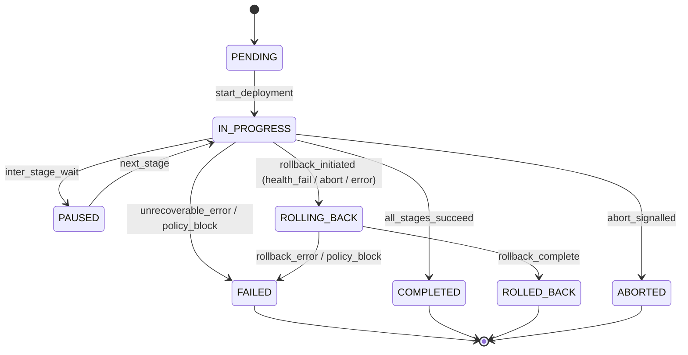
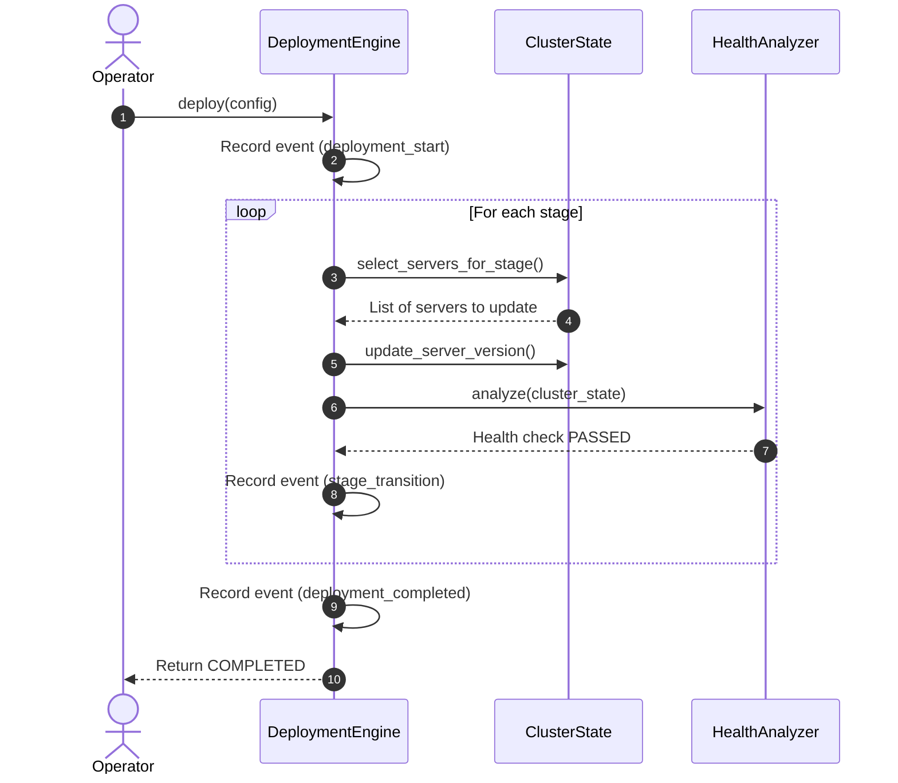
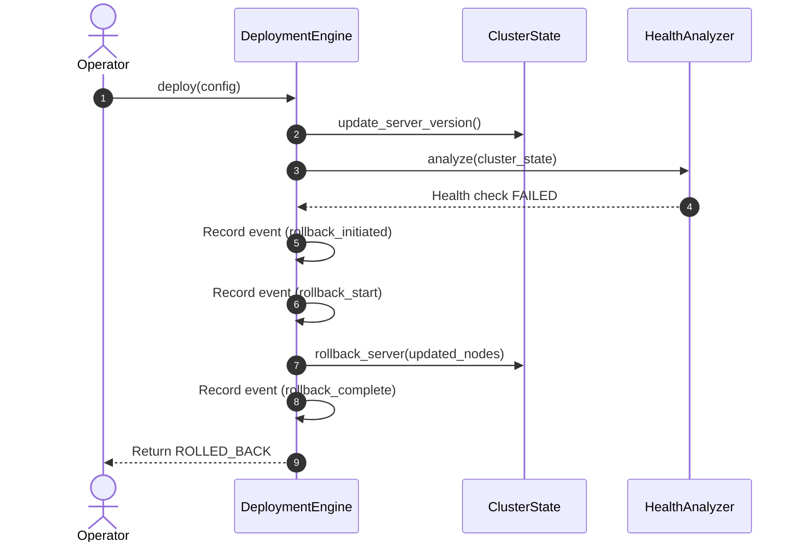
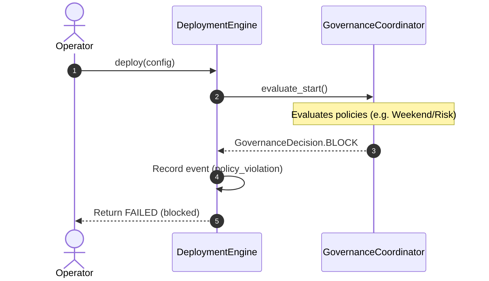
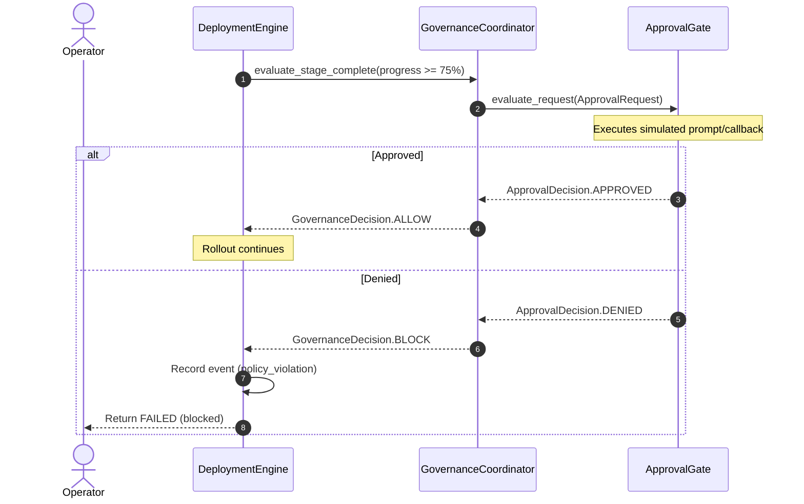
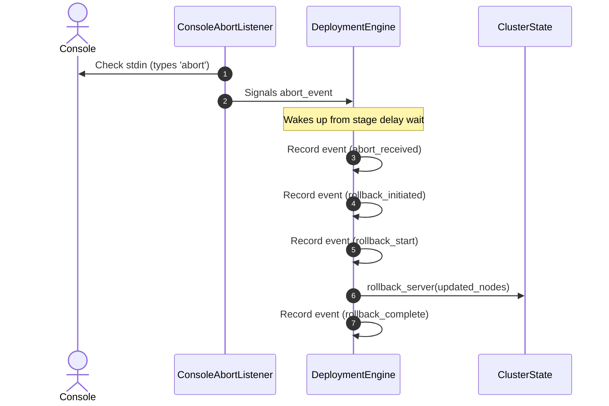
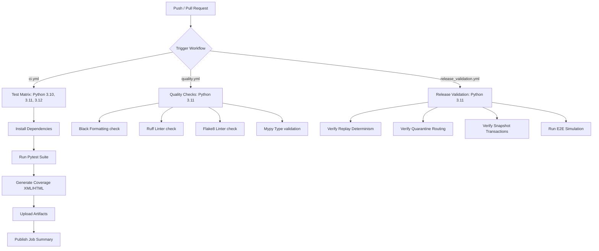

# Canary Deployment Simulator

[](https://github.com/aliakarma/bootcamp-2026-canary-deployment/actions/workflows/ci.yml)
[](https://github.com/aliakarma/bootcamp-2026-canary-deployment/actions/workflows/quality.yml)
[](https://github.com/aliakarma/bootcamp-2026-canary-deployment/actions/workflows/release_validation.yml)
[](https://codecov.io/gh/aliakarma/bootcamp-2026-canary-deployment)

A governance-aware, resilience-oriented autonomous deployment coordination simulator with operational auditability, rollback governance, deterministic replay, and reliability-aware orchestration.

---

## 1. Overview

The **Canary Deployment Simulator** is a zero-dependency, standard-library-first systems engineering platform. It models the lifecycle of complex, cross-region software rollouts over simulated server clusters. The system enforces safety, compliance, and recovery procedures at key milestones using a combined **Governance Policy Engine** and **Resilience & Recovery Layer**.

### Core Capabilities

* **Cluster Simulation (Phase 2)** — Simulates a thread-safe cluster across four geographic regions (`us-east-1`, `us-west-2`, `eu-west-1`, `ap-southeast-1`) with CPU/Memory metrics and status lifecycles.
* **Autonomous Coordination Engine (Phase 3)** — Percentage-based canary stages with customizable delay wait intervals, health retries, and failure-handling callbacks.
* **Health Analysis System (Phase 4)** — Deterministic metrics analyzer evaluating SLAs and health check pass/fail ratios.
* **Drift-Aware Rollback (Phase 5)** — Validates cluster consistency before executing rollbacks, preventing overrides on drifted servers.
* **Asynchronous Console Interceptor (Phase 6)** — Background daemon thread processing real-time console input (`abort`) for immediate, thread-safe cancellation and rollback trigger.
* **Correlated Event Tracing (Phase 7)** — Produces a JSONL audit trail tracking sequence progression with correlation IDs and causal parent-child UUID linkages.
* **Governance Policy Engine (Phase 8)** — Configurable compliance rules that intercept deployment states, block unsafe progressions, require human approvals, and prevent dangerous rollbacks.
* **Operational Resilience & Failure Recovery (Phase 9)** — Features region quarantining, point-in-time state snapshot transactions, deterministic timeline replay audits, recovery planning, and metrics aggregation.

---

## 2. Formal Deployment Lifecycle

Deployments traverse a formal state machine to ensure consistency. The following diagram illustrates all valid state transitions:



### Transition Specifications

* **PENDING → IN_PROGRESS**: Triggered when `deploy()` is invoked and the deployment passes the initial `evaluate_start` governance checks.
* **IN_PROGRESS → PAUSED**: Entered during the inter-stage observation wait; the deployment returns to `IN_PROGRESS` when the next stage begins.
* **IN_PROGRESS → COMPLETED**: Triggered when all stage updates succeed and pass all post-stage health check thresholds.
* **IN_PROGRESS → FAILED**: Triggered ONLY by unrecoverable exceptions or governance policy blocks. Rollback recovery flows do NOT produce this transition.
* **IN_PROGRESS → ROLLING_BACK**: Triggered by a `ROLLBACK_INITIATED` event from a failed stage update, failed health check, or abort signal. Initiates node reversion.
* **ROLLING_BACK → ROLLED_BACK**: Successfully completes the restoration of all target-version nodes back to the source version.
* **ROLLING_BACK → FAILED**: Occurs if a governance policy blocks the automatic rollback (e.g. `RollbackPolicy` due to `CRITICAL` risk), leaving the nodes in a partial state.

---

## 3. Architecture Diagrams

### Component Architecture

```
                                 ┌────────────────────────────────────────────────────────┐
                                 │                        main.py                         │
                                 │                   (E2E Simulator)                      │
                                 └───────────────────────────┬────────────────────────────┘
                                                             ▼
                                 ┌────────────────────────────────────────────────────────┐
                                 │                deploy/DeploymentEngine                 │
                                 │            (Rollout State Coordinator)                 │
                                 └────────┬───────────────────┬──────────────────┬────────┘
                                          │                   │                  │
                                          ▼                   ▼                  ▼
┌───────────────────────────────────────────┐ ┌─────────────────┐ ┌─────────────────────────┐
│        governance/coordinator.py          │ │  health/        │ │    cluster/state.py     │
│       (GovernanceCoordinator)             │ │  analyzer.py    │ │     (ClusterState)      │
├───────────────────────────────────────────┤ │  (Health checks)│ ├─────────────────────────┤
│  • policies.py (Rule checks)              │ └─────────────────┘ │  • models.py            │
│  • approvals.py (Approval Gates)           │                     │    (Servers & metadata) │
│  • risk.py (Risk Scoring Engine)          │                     └─────────────────────────┘
└─────────────────────┬─────────────────────┘
                      ▼
┌───────────────────────────────────────────┐
│           resilience/package              │
│                                           │
│  • snapshots.py (Point-in-time)           │
│  • quarantine.py (Region isolation)       │
│  • recovery.py (Recovery plans)           │
│  • replay.py (Timeline reconstruction)    │
│  • observability.py (Metrics aggregation) │
└───────────────────────────────────────────┘
```

---

## 4. Operational Sequence flows

### A. Successful Staged Rollout


### B. Failed Rollout + Rollback


### C. Governance-Blocked Deployment


### D. Manual Approval Gate Workflow


### E. Abort-Triggered Rollback


---

## 5. Concurrency & Synchronization Model

The system ensures strict thread safety under concurrent operations:

1. **Lock Ownership Rules**:
   - `ClusterState` protects its internal server map using a private `threading.Lock`. All read operations (e.g. `servers`, `get_server`) and write operations (e.g. `update_server_status`, `rollback_server`) acquire this lock.
   - External components must **never** acquire this lock while holding other locks, avoiding multi-lock acquisition patterns and potential deadlocks.
2. **Event Synchronization Strategy**:
   - Inter-stage waiting is implemented via `threading.Event.wait(timeout)`. This allows the background daemon thread to wake the engine immediately if the user types `abort`.
3. **Idempotent Rollback Safety**:
   - `rollback_server` checks the last action in the server's deployment history. If it is already a `"rollback"`, the function returns `True` immediately. This prevents race conditions and double-flipping when multiple threads trigger rollbacks concurrently.
4. **Thread-safe Audit Logging**:
   - `AuditLogger` synchronizes in-memory appends and file writes atomically under a **single lock acquisition**, guaranteeing that in-memory ordering is always consistent with on-disk JSONL ordering. This eliminates the TOCTOU ordering gap where concurrent threads could previously interleave between the append and file-write operations.
5. **Rollback Event Semantics**:
   - Rollback initiation emits `ROLLBACK_INITIATED` (not `DEPLOYMENT_FAILED`). This cleanly separates recoverable rollback flows from true unrecoverable failures, preventing corruption of observability metrics. `DEPLOYMENT_FAILED` is reserved exclusively for unexpected exceptions and unrecoverable error paths.

---

## 6. Resilience & Recovery System (Phase 9)

Phase 9 introduces features to protect, recover, and audit simulated infrastructure:

### Cluster Snapshots
* **Transaction Restoration**: ClusterSnapshotSystem captures point-in-time states. Restores are exception-safe: if any error occurs during restoration, the system rolls back to the backup state.
* **State Capture**: Captures server versions, statuses, deployment progress, and risk telemetry.

### Recovery Planning
* **Partial Rollback**: Reverts only degraded nodes, allowing healthy updated nodes to continue serving traffic.
* **Staged Recovery**: Gradually rolls back nodes in small batches to prevent network load spikes ("rollback storms").
* **Quarantine Routing**: Automatically quarantines unstable regions (degradation > 30%) and routes rollout stages away from them.

### Replay & Observability
* **Causality Replay**: Parses JSONL log trails, builds parent-child graphs using `parent_event_id` pointers, and detects trace corruption.
* **Observability Aggregator**: Measures metrics like rollback frequency, deployment duration bounds, and region failure counts. Correctly distinguishes `ROLLBACK_INITIATED` (recoverable rollbacks) from `DEPLOYMENT_FAILED` (unrecoverable failures), preventing metric inflation.
* **Event Semantics**: The `ROLLBACK_INITIATED` event type tracks deployments that entered rollback recovery. The `DEPLOYMENT_FAILED` event type is reserved for true unrecoverable failures. This separation ensures observability dashboards accurately reflect operational health.

---

## 7. Operational Safety & Limitations

### Safety Guarantees
1. **Rollback Storm Prevention** — Blocks automatic rollbacks if the rate of rollbacks exceeds a ceiling, preventing cascading failures.
2. **Drift Detection Guard** — Halts manual rollbacks if a server shows version drift (e.g., manually updated), preventing accidental overrides unless forced.

### Known Limitations
* **Centralized Governance** — Policy evaluation resides in-process. It has single-point-of-failure assumptions and does not simulate distributed network splits.
* **In-Memory State** — Simulates server states in memory. Restarts clear configurations unless serialized to disk via snapshots.
* **No Distributed Consensus** — Relies on local thread synchronization rather than distributed consensus algorithms (e.g., Raft).

---

## 8. AI Code Review Evidence

### Methodology
Conducted systematic static code analysis, thread trace verification, and simulation stress testing.

### Key Issues Identified & Fixed
* **Deadlock in Test Properties**: In Phase 8, `test_risk_score_critical` deadlocked on Python's non-reentrant locks. Resolved by accessing states through thread-safe transition methods.
* **Double-Rollback Version Flip**: Concurrent rollback triggers double-flipped server states due to non-atomic check-and-set version flips. Fixed by making `rollback_server` check deployment history.
* **Lineage Event Reordering**: Snapshot events recorded at deployment start were logged before `deployment_start` events, breaking trace causality graphs. Resolved by reordering execution milestones.

---

## 9. Setup & Execution

### Prerequisites
* Python 3.10+

### Installation
```bash
# Clone the repository
git clone https://github.com/aliakarma/bootcamp-2026-canary-deployment.git
cd bootcamp-2026-canary-deployment

# Setup virtual environment
python -m venv venv
# Windows
.\venv\Scripts\activate
# macOS/Linux
source venv/bin/activate

# Install dependencies
pip install -r requirements.txt
```

### Running the E2E Simulation
To run the full suite of staged rollouts, console aborts, failure injections, drift validation, and Phase 9 resilience recovery scenarios:
```bash
python main.py
```

### Running the Tests
To run the 168 automated unit, integration, and stress tests:
```bash
pytest tests/ -v
```

---

## 10. Enterprise CI/CD & Quality Hardening (Phase 10)

The Canary Deployment Simulator features a production-grade continuous validation and quality assurance pipeline. Every commit, merge, and pull request is verified against strict guidelines to ensure governance policies, safety constraints, and resilience patterns are preserved.

All workflows trigger on `main`, `master`, and `ali-akarma/canary-deployment` branches for both push and pull request events.



### GitHub Actions Workflows

1. **Continuous Integration (`ci.yml`)**
   - **Multi-Version Testing**: Runs the complete test suite (unit, integration, and concurrency stress tests) in parallel across Python `3.10`, `3.11`, and `3.12`.
   - **Environment Isolation**: Executes on clean `ubuntu-latest` environments with automated caching of `pip` dependencies.
   - **Coverage Tracking**: Runs tests using `pytest-cov`, exporting `coverage.xml` and an interactive `htmlcov/` dashboard as retention-safe pipeline artifacts.
   - **Dynamic Coverage Reporting**: Uploads `coverage.xml` to [Codecov](https://codecov.io/gh/aliakarma/bootcamp-2026-canary-deployment) for live, per-commit coverage tracking with Python version matrix flag merging.
   - **Test summaries**: Automatically parses JUnit XML results and coverage files to generate a Markdown summary table directly in the GitHub Actions Job Summary view.

2. **Quality Assurance (`quality.yml`)**
   - **Formatting Enforcement**: Runs `black --check .` to validate line-wrapping and spacing.
   - **Multi-Engine Linting**: Inspects imports and PEP8 compliance using both `ruff` and `flake8`.
   - **Static Type Safety**: Runs `mypy .` to enforce type annotations.

3. **Release Validation (`release_validation.yml`)**
   - **Causality & Replay Consistency**: Ensures log replay engines can reconstruct exact timeline state machines from serialized audit trails.
   - **Snapshot Transaction Safety**: Validates that failed snapshots roll back fully and leave zero half-updated states.
   - **E2E Simulation Validation**: Runs the entire canary deployment simulation (`python main.py`) from scratch to verify runtime reliability.

---

### Local Quality Validation

Before committing any changes, run the following commands to ensure local code quality matches the CI/CD requirements:

```bash
# 1. Format Code
black .

# 2. Run Linters
ruff check .
flake8 .

# 3. Check Types
mypy .

# 4. Run Tests & Check Coverage
pytest
```

---

### Contributor Workflow & Guidelines

1. **Setup Isolated Dev Environment**: Install all development dependencies via `pip install -r requirements-dev.txt`.
2. **Adhere to Code Formatting**: All Python code must be formatted with `black` using a max line length of 100 characters.
3. **Type Annotations**: All new functions and classes must specify type signatures. Run `mypy .` to verify.
4. **Preserve History & Semantics**: Never modify stable interfaces. All telemetry and governance events must remain backward compatible.
5. **Dependency Separation**: Runtime dependencies go in `requirements.txt` (currently empty — standard-library-first). Development and quality tools go in `requirements-dev.txt`.

---

### Troubleshooting & Debugging

- **Mypy `union-attr` Warnings**: When fetching servers using `get_server()`, Mypy might raise warnings about `None` types. Use a conditional check, assertions (`assert server is not None`), or inline comments `# type: ignore[union-attr]` to resolve.
- **Ruff `E501` Warning (Line too long)**: Ruff is configured to ignore `E501` since code line lengths are automatically enforced and wrapped by `black`. Comments and docstrings can exceed 100 characters where descriptive clarity is needed.
- **Flake8 `C901` Complexity Warning**: Complexity check is bypassed for naturally complex operational state coordination algorithms (e.g., stage routing, policy evaluations). Use `ignore = C901` or inline comments.

